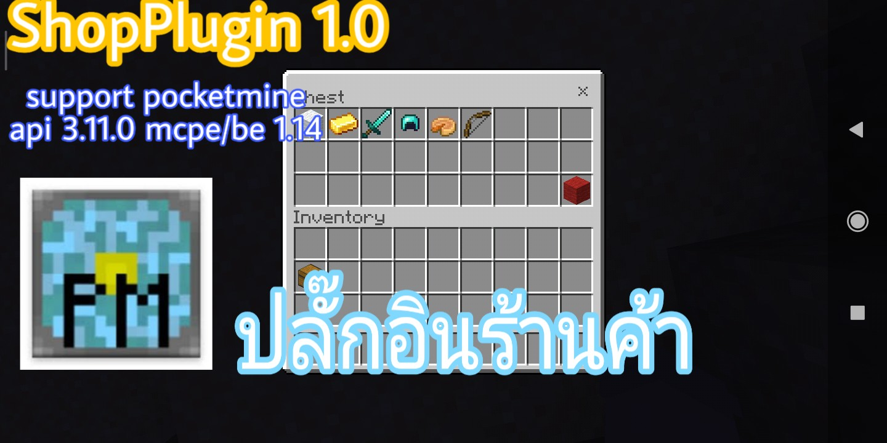

```diff
คุณต้องลงปลั๊กอิน
- EconomyAPI
- FormAPI
ถึงปลั๊กอินนี้จะทำงาน
```

#Dowload Plugin EconomyAPI [Click here](https://poggit.pmmp.io/p/economyapi)

#Dowload Plugin FormAPI [Click here](https://poggit.pmmp.io/p/FormAPI)


**คุณสมบัติของปลั๊กอิน**<br>
- เป็นปลั๊กอินสร้างร้านค้าชื้อและขาย
- คุณสามารถ เพิ่ม/ลบ สินค้าได้
- สามารถเลือกจำนวนสินค้าตามราคาที่ตั้งต่อชิ้นไว้ได้
- มี gui chest
- มี gui form


**วิธีใช้งาน**<br>
- เวอร์ชั่น 1.0 คลิปตัวอย่าง [คลิก](https://youtu.be/Rd7uGpD1tIU)


## ดาวโหลด
| version  | plugin support                        | Download  zip/phar                                                 |
| ---- | ------------------------------------ | ---------------------------------------------------------- |
| 1.0  | pocketmine api 3.11.0 mcpe 1.14 [Click here](https://github.com/pmmp/PocketMine-MP) | [คลิก](https://github.com/HmmHmmmm/ShopPlugin/releases/1.0) |


## Commands
| command  | description                        | permission                                                 |
| ---- | ------------------------------------ | ---------------------------------------------------------- |
| /shop  | เปิด gui chest | true |
---------------------------------------------------------- |
| /shop info  | เครดิตผู้สร้างปลั๊กอิน | op |
---------------------------------------------------------- |
| /shop category create <ตั้งชื่อรายการ> <ชื่อเต็มของรายการ> <item-id> <item-damage>  | สร้างรายการ | op |
---------------------------------------------------------- |
| /shop category remove <ชื่อรายการ>  | ลบรายการ | op |
---------------------------------------------------------- |
| /shop category additem <ชื่อรายการ> <ราคาชื้อ> <ราคาขาย> <item-id> <item-damage>  | เพิ่มไอเทมในรายการ | op |
---------------------------------------------------------- |
| /shop category removeitem <ชื่อรายการ> <item-id> <item-damage>  | ลบไอเทมในรายการ | op |
---------------------------------------------------------- |
| /shop category icon <ชื่อรายการ> <item-id> <item-damage>  | เปลี่ยนiconในรายการ | op |
---------------------------------------------------------- |
| /shop category changename <ชื่อรายการ> <ชื่อเต็มของรายการ>  | เปลี่ยนชื่อเต็มในรายการ | op |
---------------------------------------------------------- |
| /shop category list  | ดูรายการทั้งหมด | op |


## LICENSE
ใบอนุญาต GPL-3.0 [license](https://github.com/HmmHmmmm/ShopPlugin/blob/master/LICENSE)